# 🐕같이가개(강아지 산책 커뮤니티)

# 🎬UCC

<!--  -->

※ 이미지 클릭시 UCC youtube 이동

# 👶프로젝트 소개 (2023.10.09 ~ 2023.11.17)

## 🐶기획 배경

### 반려동물 인구 `1300만`명, 그러나 TOP 10 반려동물 앱 사용자는 `90만`명에 그쳐

- 꾸준히 증가하여 1300만 명에 달한 대한민국 반려견 인구
- 커뮤니티는 여럿 있지만 아직 하나의 커다란 커뮤니티는 등장하지 않음

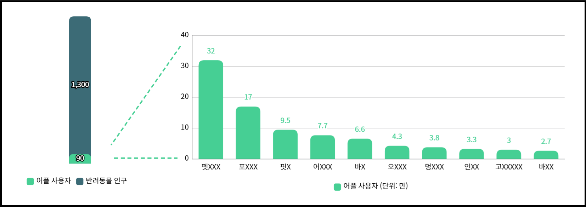

### 관계 확장, 일상 공유라는 반려견 앱 틈새시장

- 반려인구는 반려견 커뮤니티를 사용하는 이유로 정보 제공에 `69%`를 꼽은 반면 관계 확장, 일상 공유는 각각 `15%` 와 `16%`에 그침
- 정보 제공과 공유 이외 다른 기능으로 사용하기 불편했던 반려견 커뮤니티의 단점을 보완하여 관계 확장과 일상 기능을 추가한 반려견 커뮤니티 앱 개발

 
 

## 👍기대 효과

- 반려견을 통한 SNS 문화 확산
- 반려견 커뮤니티를 통한 반려인구의 관계 확장
- 온라인 뿐 만 아닌 오프라인에서의 지역 커뮤니티 활성화

 
 

## 👨‍🏫 주요 기능

| 기능      | 내용                                                                                                                                          |
| --------- | --------------------------------------------------------------------------------------------------------------------------------------------- |
| 피드 기능 | 2km 이내의 다른 사용자들이 올린 게시물을 보여준다. 좋아요, 댓글을 통해 관심을 표현할 수 있다. 사진 게시 가능                                  |
| 산책 기능 | 산책 시작을 통해 움직이는 경로를 저장할 수 있다. 시간과 거리를 체크하여 산책을 기록할 수 있다.                                                |
| 매칭 기능 | 3km 이내의 다른 사용자들을 만날 수 있다. 사용자가 등록한 기준에 따라 어울리는 우선순위에 따라 매칭되며 매칭된 상대에게 친구신청을 할 수 있다. |
| 채팅 기능 | 친구관계의 다른 사용자와 산책할 시간,장소 등을 정하기 위한 채팅 할 수 있다.                                                                   |

 
 

## 🔥 서비스 화면 소개

### 1. 회원가입

| 
이메일 인증 요청
                | 
이메일 검증
                          | 
닉네임 중복체크
             |
| ----------------------------------------------------- | ---------------------------------------------------------- | ------------------------------------------------- |
| 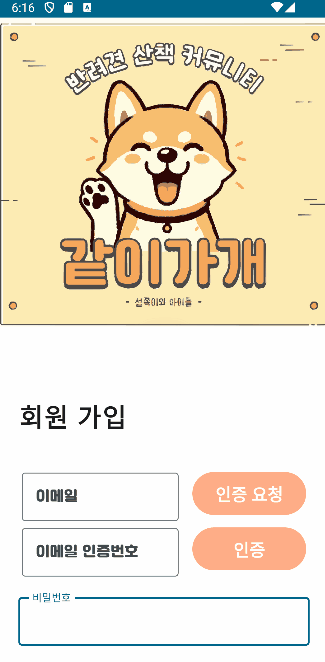 | 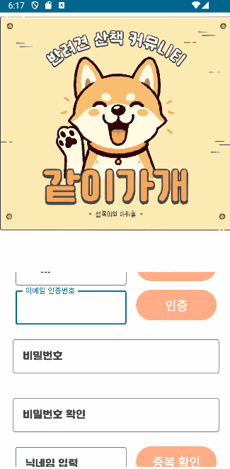 | 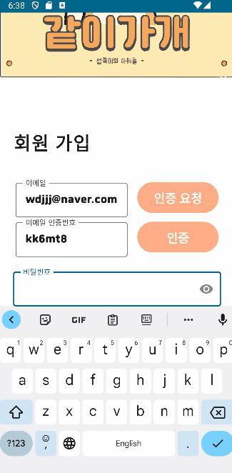 |

 

### 2. 로그인

> > 

 

### 3. 피드

| 
피드 작성
                    | 
피드 삭제
                    | 
좋아요
               |
| -------------------------------------------------- | -------------------------------------------------- | ------------------------------------------ |
|  |  | 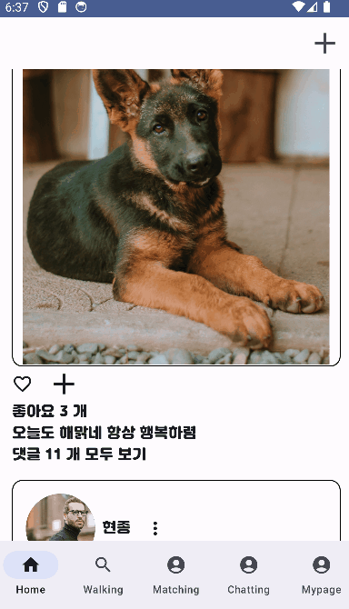 |

 

### 4. 댓글

| 
댓글 작성
                       | 
댓글 삭제
                       |
| ----------------------------------------------------- | ----------------------------------------------------- |
|  | 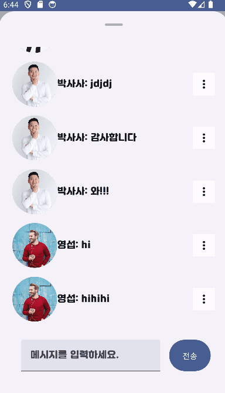 |

 

### 5. 산책

> > 

 

### 6. 매칭

> > 

 

### 7. 채팅

| 
채팅방 생성
                  | 
채팅창
                   |
| -------------------------------------------------- | ---------------------------------------------- |
|  | 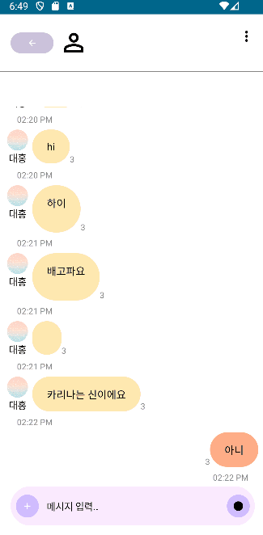 |

 

### 8. 마이페이지

| 
프로필 피드 이동
             | 
마이페이지
             |
| -------------------------------------------------- | -------------------------------------------- |
|  |  |

 

### 9. FCM 알림 (친구 신청 관련)

| 
친구 요청 알림
               | 
친구 수락
                         | 
이미 친구인 관계
              |
| -------------------------------------------------- | ------------------------------------------------------- | --------------------------------------------------- |
|  |  | 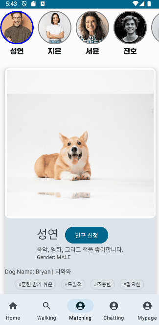 |

 
 

## ⚙️ 개발 환경

### ✨Front-end✨

- Android
  - Sdk 34
  - jdk 17
- Jetpack Compose
- Hilt
- Lifecycle
- Google Maps
- Firebase Cloud Messaging

 

### ✨Back-end✨

- Java : OpenJDK 11
- Spring Boot v2.7.14
- Spring Webflux
- Spring Security
- Stomp
- Spring Data JPA
- Querydsl
- Kafka
- Firebase Cloud Messaging
- MySQL
- MongoDB
- Redis
- Javacv

 

### ✨INFRA✨

- AWS EC2
- Docker
- Jenkins

 

### ✨협업 툴✨

&nbsp;&nbsp;&nbsp;&nbsp;&nbsp;

- 형상 관리 : Git
- 이슈 관리 : Jira
- 커뮤니케이션 : Mattermost, Webex, Notion
- 디자인 : Figma

 

### ✨IDE✨

- IntelliJ
- Android Studio

---

## 📚 기술 차별점

### **spring webflux를 통한 비동기 업로드 서버**

1. spring webflux와 r2dbc를 이용해 비동기로 업로드 서버

- 큰 용량의 파일 업로드는 기존의 동기 처리로는 지연이 일어날 수 있어 비동기 및 병렬처리를 적용해 동시성 처리를 적용했습니다.
  또한 완전한 비동기 처리 구현을 위해 R2DBC를 도입해 DB 쿼리의 논블로킹 실행을 가능하게 하였습니다.

 

2. 효율적인 저장공간 활용을 위한 인코딩 처리

- 파일의 경우 JavaCV 라이브러를 사용해 파일을 인코딩 하여 품질의 열화를 최소화 하며 저장공간을 효율적으로 사용하려 하였습니다.
  인코딩의 경우 예를 들어 3840x2400 해상도의 수직,수평 해상도 300DPI의 7.70MB의 파일을 JPG로 인코딩 하며 수직, 수평 해상도 96DPI의 0.98MB의 파일로 인코딩이 처리됩니다.
  인코딩의 과정에서 파일의 이름 중복 방지를 위해 UUID를 생성해 저장 처리를 하였습니다.

 

### **GPS 서버**

1. MongoDB 도입
   앱의 위치정보 기록을 서버에서 저장하고 리턴하는 서비스를 위해서 GPS 데이터 저장이 필요했고 [(위도, 경도), (위도, 경도)] 형태의 데이터를 효율적으로 처리하기 위해 NoSQL인 MongoDB를 도입했습니다.
   또한 해당 데이터는 Join 등의 작업은 없고 Read와 Write, Delete만 필요한 기능이었기 때문에 MongoDB 도입에 장애가 없었습니다.
2. Entity 처리
   Entity 생성에 있어 위도와 경도를 별도의 칼럼으로 만드는 형태가 아닌 GpsPoints라는 클래스로 생성해 유효성 검사 등의 책임을 분리해 처리하였습니다.
3. PageNation 적용
   앱에서 최초에는 LazyColumn을 적용해 기록을 확인했는데 해당 기록이 양이 증가할수록 보기 힘들어져 데이터에 PageNation을 적용해 전달하였습니다.

 

### **Matching 서버**

1. 추천 서비스 기반

- 앱 실행시 사용자의 위도,경도 정보를 서버로 전송해 갱신
- 하버사인공식을 사용해 사용자의 위치로부터 4km 이내의 사용자들을 필터링
- 사용자들이 등록해 놓은 강아지의 성향의 교집합에 따라 정렬 후 추천

 

2. 하버사인공식을 통한 필터링을 쿼리에 적용

- 해당 공식을 통한 사용자 필터링에 있어 자바의 stream의 filter를 이용해 계산해 적용하는 경우와 JPA 쿼리를 사용해 필터링 하는 방식 사이에 고민을 했습니다. JPA 쿼리를 사용했을 때의 장점이 다음과 같아 JPA 쿼리를 채용했습니다.
  1. 데이터베이스의 최적화
     쿼리를 직접 실행하기 때문에 DB 내에서 최적화된 검색을 수행할 수 있습니다. 이를 통해 인덱스를 사용하여 빠르게 결과를 반환할 수 있습니다.
  2. 데이터 전송 최소화
     필터링 된 데이터를 서버로 전송하기 때문에 처리하는 데이터 양이 작아 더 효율적입니다.
  3. 코드 간결성
     복잡한 계산을 쿼리에서 실행하기 때문에 비즈니스 로직이 간결해지고 가독성이 높아집니다.

 

### 채팅 기능

1. Stomp + Kafka를 이용한 채팅기능 구현

- Stomp : pub/sub 구조로 메시지를 전송하고 메시지를 받아 처리하는 부분이 명확

  - /pub/message : 채팅방에 메시지 전송
  - /sub/chatroom/{roomId} : 현재 입장한 채팅방 번호 구독
  - /sub/notice/{roomId} : 현재 입장한 채팅방의 notice 전용 구독(어떤 사용자가 채팅방에 들어왔다는지 등의 공지)
  - Inbound Channel Interceptor 를 통한 웹소켓용 JWT 인증 절차

- Kafka : 분산 메시징 시스템으로, 대량의 메시지를 효율적으로 처리, 이벤트 스트리밍을 통해 실시간 메시징을 처리하는 데 효과적, 메시지 손실을 방지

2. 채팅 메시지 읽음 처리 기능

- NoSQL 데이터베이스로 대용량 채팅 데이터를 처리 / 빠른 데이터 읽기, 쓰기 성능을 목표

- Redis : 읽음 처리를 위해 채팅방 입장, 퇴장 등 실시간 채팅방에 접속중인 사용자들을 userId, chatroomId 로 저장

- MongoDB : 메시지 내용, 해당 메시지를 읽은 유저 등 채팅기록 데이터 관리

- MySQL : 채팅방 및 유저관계 등의 순수 채팅방 데이터는 RDB에 저장

 

### Security 특이점

- `HS256(HMAC SHA256)` 알고리즘을 통해 비밀번호를 인코딩하여 DB에 등록했습니다.
- `JWT`의 `Access Token`을 활용해 `Authorization`, `Authentication` 기능을 구현했습니다.

 

### jetpack compose

- 안드로이드 앱 개발을 수행하면서 모든 Screen 컴포저블 함수에 매개변수를 매번 넘겨주는 불편함과 React에서의 props drilling같은 문제점
  - ViewModel을 통해 데이터를 관리.

하지만, 앱을 종료한 이후에도 데이터를 남기고 싶어 해당 부분은 DataStore를 통해 구현하였습니다.
DataStore란 프로토콜 버퍼를 사용해 key-value 쌍이 지정된 객체를 저장할 수 있는 데이터 저장소 솔루션으로 코루틴 및 flow를 써서 비동기적이고 일관된 트랜잭션 방식으로 데이터를 저장한다.

프로토콜 버퍼란? 구조화된 데이터를 직렬화하기 위한 구글의 언어 중립적, 플랫폼 중립적, 확장 가능한 매커니즘이다.
또한, 컴포저블간의 이동 중에 ViewModel인스턴스에 대한 관리나 생성과 소멸에 대한 구현이 어렵고,
이에 클래스 생성에 대한 의존성을 줄이고 원활한 코드 작성을 위해 DI(Dependency Injection)을 사용해 문제를 해결하였습니다.

저희는 Dagger Hilt를 채택하여 코드의 재사용성을 향상시키고,
객체간 의존성 & 결합성을 줄여 코드를 좀 더 유연하게 짤 수 있었습니다.
의존성 주입을 위한 선행작업과 코드의 가독이 조금 어려워진다는 단점도 있으나 장점이 더욱 많아 사용하게 되었습니다.

 
 

## 아키텍쳐

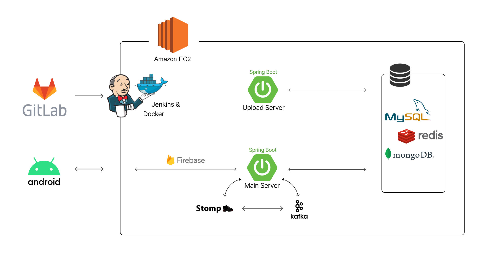

## ERD

## 👨‍👩‍👧 협업 툴

#### Jira

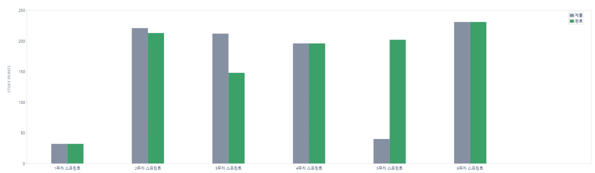

#### Notion

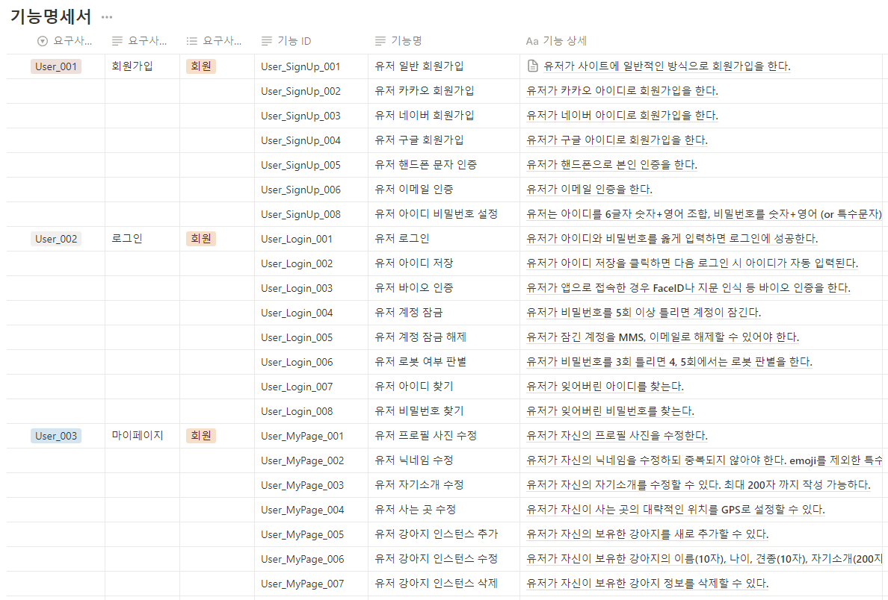

#### Figma

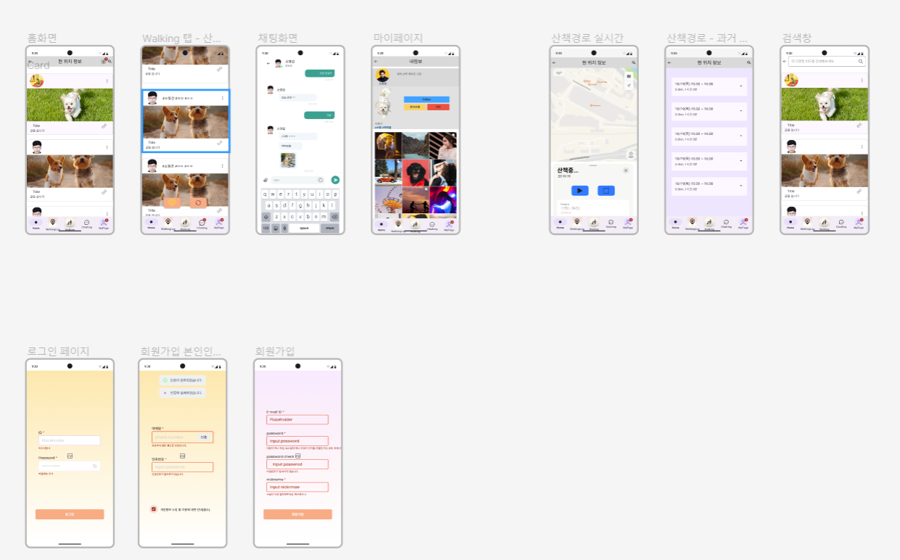

 
 

# 👩‍💻 팀원 역할 분배

| 
<a href="https://github.com/1212Hong">김대홍</a>
                         | 
<a href="https://github.com/dwdjjj">권영재</a>
                                                           | 
<a href="https://github.com/phabala ">김기홍</a>
       | 
<a href="https://github.com/bellringstar">김현종</a>
                                                                       | 
<a href="https://github.com/youngseobso">소영섭</a>
     | 
<a href="https://github.com/Strewbarry">이성연</a>
                                                                                    |
| ---------------------------------------------------------------------------------------------- | ------------------------------------------------------------------------------------------------------------------------------ | ---------------------------------------------------------------------------- | ------------------------------------------------------------------------------------------------------------------------------------------------ | ----------------------------------------------------------------------------- | ------------------------------------------------------------------------------------------------------------------------------ |
|  |  |  | </a> |  |  |
| 
Leader & Backend
                                                         | 
Frontend
                                                                                                 | 
Backend
                                                | 
Backend & Infra
                                                                                                            | 
Frontend & Infra
                                        | 
Backend
                                                                                                  |

 
