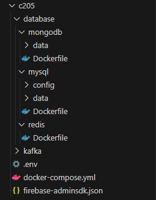

## 개발 환경

### Front-end

- Android
  - Sdk 34
  - jdk 17
- Jetpack Compose
- Hilt
- Lifecycle
- Google Maps
- Firebase Cloud Messaging

### Back-end

- openjdk:11
- Spring Boot v2.7.14
- Spring Webflux
- Spring Security
- Stomp
- Spring Data JPA
- Querydsl
- Kafka
- Firebase Cloud Messaging
- MySQL
- MongoDB
- Redis

### INFRA

- AWS EC2
- Docker
- Jenkins

### IDE

- IntelliJ
- Android Studio

---

## 백엔드 EC2 환경설정

### 1. Docker 설치

```bash
sudo apt-get update
sudo apt-get install ca-certificates curl gnupg

sudo install -m 0755 -d /etc/apt/keyrings
curl -fsSL https://download.docker.com/linux/ubuntu/gpg | sudo gpg --dearmor -o /etc/apt/keyrings/docker.gpg
sudo chmod a+r /etc/apt/keyrings/docker.gpg

echo \
  "deb [arch="$(dpkg --print-architecture)" signed-by=/etc/apt/keyrings/docker.gpg] https://download.docker.com/linux/ubuntu \
  "$(. /etc/os-release && echo "$VERSION_CODENAME")" stable" | \
  sudo tee /etc/apt/sources.list.d/docker.list > /dev/null

sudo apt-get update
```

---

### 2. Docker Engine 설치

https://docs.docker.com/engine/install/ubuntu/

```bash
sudo apt-get install docker-ce docker-ce-cli containerd.io docker-buildx-plugin docker-compose-plugin

sudo docker run hello-world
```

---

### 3. Docker-compose 를 통한 배포

#### (1) EC2에 폴더구조 생성하기



- develop 브랜치 /BE/databse 폴더 복사하여 EC2 내부 경로에 database 생성
- .env 생성

```bash
# 각 DB USER, PW 값
MYSQL_DATABASE = ???
MYSQL_USER = ???
MYSQL_PASSWORD = ???
MYSQL_ROOT_PASSWORD = ???
MONGO_USER = ???
MONGO_PASSWORD = ???
JWT_SECRET_KEY = ???
MAIL_USERNAME=??? # GMail 발신 아이디
MAIL_PASSWORD=???
```

- docker-compose.yml

```bash
### docker-compose.yml
version: "3.8"
services:
  mysql:
    container_name: mysql
    build:
      context: ./database/mysql
      dockerfile: Dockerfile
    restart: always
    environment:
      - MYSQL_DATABASE=${MYSQL_DATABASE}
      - MYSQL_USER=${MYSQL_USER}
      - MYSQL_PASSWORD=${MYSQL_PASSWORD}
      - MYSQL_ROOT_PASSWORD=${MYSQL_ROOT_PASSWORD}
    ports:
      - "3306:3306"
    volumes:
      - ./database/mysql/data:/var/lib/mysql
      - ./database/mysql/data:/var/lib/mysql-files

  mongodb:
    container_name: mongodb
    build:
      dockerfile: Dockerfile
      context: ./database/mongodb
    restart: always
    ports:
      - "27017:27017"
    volumes:
      - ./database/mongodb/data:/data/db
    environment:
      - MONGO_INITDB_ROOT_USERNAME=${MONGO_USER}
      - MONGO_INITDB_ROOT_PASSWORD=${MONGO_PASSWORD}

  redis:
    container_name: redis
    build:
      dockerfile: Dockerfile
      context: ./database/redis
    restart: always
    ports:
      - "6379:6379"

  zookeeper-1:
    container_name: zookeeper1
    hostname: zookeeper1
    image: confluentinc/cp-zookeeper:6.2.0
    environment:
      ZOOKEEPER_SERVER_ID: 1
      ZOOKEEPER_CLIENT_PORT: 12181
      ZOOKEEPER_DATA_DIR: ./zookeeper/data
      ZOOKEEPER_SERVERS: zookeeper1:22888:23888;zookeeper2:32888:33888;zookeeper3:42888:43888
    ports:
      - 12181:12181
      - 22888:22888
      - 23888:23888
    volumes:
      - ./kafka/zookeeper/data/1:/zookeeper/data

  zookeeper-2:
    container_name: zookeeper2
    hostname: zookeeper2
    image: confluentinc/cp-zookeeper:6.2.0
    environment:
      ZOOKEEPER_SERVER_ID: 2
      ZOOKEEPER_CLIENT_PORT: 22181
      ZOOKEEPER_DATA_DIR: ./zookeeper/data
      ZOOKEEPER_SERVERS: zookeeper1:22888:23888;zookeeper2:32888:33888;zookeeper3:42888:43888
    ports:
      - 22181:22181
      - 32888:32888
      - 33888:33888
    volumes:
      - ./kafka/zookeeper/data/2:/zookeeper/data

  zookeeper-3:
    container_name: zookeeper3
    hostname: zookeeper3
    image: confluentinc/cp-zookeeper:6.2.0
    environment:
      ZOOKEEPER_SERVER_ID: 3
      ZOOKEEPER_CLIENT_PORT: 32181
      ZOOKEEPER_DATA_DIR: ./zookeeper/data
      ZOOKEEPER_SERVERS: zookeeper1:22888:23888;zookeeper2:32888:33888;zookeeper3:42888:43888
    ports:
      - 32181:32181
      - 42888:42888
      - 43888:43888
    volumes:
      - ./kafka/zookeeper/data/3:/zookeeper/data

  kafka-1:
    image: confluentinc/cp-kafka:6.2.0
    container_name: kafka1
    hostname: kafka1
    depends_on:
      - zookeeper-1
      - zookeeper-2
      - zookeeper-3
    environment:
      KAFKA_BROKER_ID: 1
      KAFKA_ZOOKEEPER_CONNECT: zookeeper1:12181,zookeeper2:22181,zookeeper3:32181
      KAFKA_LISTENERS: INTERNAL://kafka1:9092,EXTERNAL://kafka1:19092
      KAFKA_ADVERTISED_LISTENERS: INTERNAL://kafka1:9092,EXTERNAL://localhost:19092
      KAFKA_LISTENER_SECURITY_PROTOCOL_MAP: INTERNAL:PLAINTEXT,EXTERNAL:PLAINTEXT
      KAFKA_INTER_BROKER_LISTENER_NAME: INTERNAL
    ports:
      - 19092:19092
      - 9092:9092
    volumes:
      - ./kafka/logs/1:/kafka

  kafka-2:
    image: confluentinc/cp-kafka:6.2.0
    container_name: kafka2
    hostname: kafka2
    depends_on:
      - zookeeper-1
      - zookeeper-2
      - zookeeper-3
    environment:
      KAFKA_BROKER_ID: 2
      KAFKA_ZOOKEEPER_CONNECT: zookeeper1:12181,zookeeper2:22181,zookeeper3:32181
      KAFKA_LISTENERS: INTERNAL://kafka2:9093,EXTERNAL://kafka2:29092
      KAFKA_ADVERTISED_LISTENERS: INTERNAL://kafka2:9093,EXTERNAL://localhost:29092
      KAFKA_LISTENER_SECURITY_PROTOCOL_MAP: INTERNAL:PLAINTEXT,EXTERNAL:PLAINTEXT
      KAFKA_INTER_BROKER_LISTENER_NAME: INTERNAL
      KAFKA_LOG_DIRS: ./kafka
    ports:
      - 29092:29092
      - 9093:9093
    volumes:
      - ./kafka/logs/2:/kafka

  kafka-3:
    image: confluentinc/cp-kafka:6.2.0
    hostname: kafka3
    container_name: kafka3
    depends_on:
      - zookeeper-1
      - zookeeper-2
      - zookeeper-3
    environment:
      KAFKA_BROKER_ID: 3
      KAFKA_ZOOKEEPER_CONNECT: zookeeper1:12181,zookeeper2:22181,zookeeper3:32181
      KAFKA_LISTENERS: INTERNAL://kafka3:9094,EXTERNAL://kafka3:39092
      KAFKA_ADVERTISED_LISTENERS: INTERNAL://kafka3:9094,EXTERNAL://localhost:39092
      KAFKA_LISTENER_SECURITY_PROTOCOL_MAP: INTERNAL:PLAINTEXT,EXTERNAL:PLAINTEXT
      KAFKA_INTER_BROKER_LISTENER_NAME: INTERNAL
      KAFKA_LOG_DIRS: ./kafka
    ports:
      - 39092:39092
      - 9094:9094
    volumes:
      - ./kafka/logs/3:/kafka
```

- docker compose 명령어
  ```bash
  docker compose -f docker-compose.yml up -d
  ```

---

#### (2) .env

- BE, fileupload 백엔드 서비스 docker 내부에 .env 만들어주기
- /BE/.env
- /fileupload/.env

- 복사 명령어

```bash
docker cp /home/ubuntu/c205/.env "BE Docker CONTAINER ID":/var/jenkins_home/workspace/Dog/BE/
```

```bash
docker cp /home/ubuntu/c205/.env "fileupload Docker CONTAINER ID":/var/jenkins_home/workspace/Dog/fileupload/
```

#### (3) Firebase 관련

- BE docker 내부
  - \BE\src\main\resources\Firebase Admin SDK 비공개 키 json 파일 넣어주기
- \FE\dog\app\google-services.json 넣어주기

- 복사 명령어

```bash
docker cp /home/ubuntu/c205/firebase-adminsdk.json "BE Docker CONTAINER ID":/var/jenkins_home/workspace/Dog/BE/src/main/resources/
```

---

---

#### DB 정보

- MySQL

  ```bash
  k9c205.p.ssafy.io:3306
  schema : dog

  ```

- MongoDB

  ```bash
  k9c205.p.ssafy.io:27017
  schema : dog

  ```

- Redis
  ```bash
  k9c205.p.ssafy.io:6379
  ```

---

## 백엔드 빌드

### 1. DockerFile

```bash
# 스테이지 1: 빌드 스테이지
FROM amazoncorretto:11 as build

# 어플리케이션의 jar 파일을 가져옵니다. 이 ARG는 Docker 빌드 시에 전달됩니다.
ARG JAR_FILE=build/libs/app.jar

# jar 파일을 컨테이너 내부의 app.jar로 복사합니다.
COPY ${JAR_FILE} app.jar

# target/dependency 디렉토리를 생성하고 app.jar를 해당 디렉토리에 압축 해제합니다.
RUN mkdir -p target/dependency && (cd target/dependency; jar -xf /app.jar)

# 스테이지 2: 실행 스테이지
FROM amazoncorretto:11

# /tmp 디렉토리를 볼륨으로 설정합니다.
VOLUME /tmp

# Build 스테이지에서 생성한 target/dependency 디렉토리를 DEPENDENCY 환경 변수로 설정합니다.
ARG DEPENDENCY=/target/dependency

# 필요한 파일들을 Build 스테이지에서 생성한 디렉토리로부터 복사합니다.
COPY --from=build ${DEPENDENCY}/BOOT-INF/lib /app/lib
COPY --from=build ${DEPENDENCY}/META-INF /app/META-INF
COPY --from=build ${DEPENDENCY}/BOOT-INF/classes /app

# 어플리케이션을 실행합니다.
ENTRYPOINT ["java", "-cp", "app:app/lib/*", "com.ssafy.dog.DogApplication"]

```

- module 설치 및 빌드, docker 이미지를 만드는 과정을 거칩니다. 그 이후에 배포를 완료합니다.

- 프로젝트 폴더 내에 있는 back-end 디렉토리의 루트 경로에서 다음의 명령어를 실행합니다.

```bash
# jar 파일 생성
gradlew build
```

## 프론트 배포

### 1. Firebase 관련

- Firebase google-services.josn 파일
  - \FE\dog\app\google-services.json 넣어주기

### 2. Build

- Build -> Generate Signed Bundle / APK... -> APK -> 설정따라서 apk release 버전으로 배포
